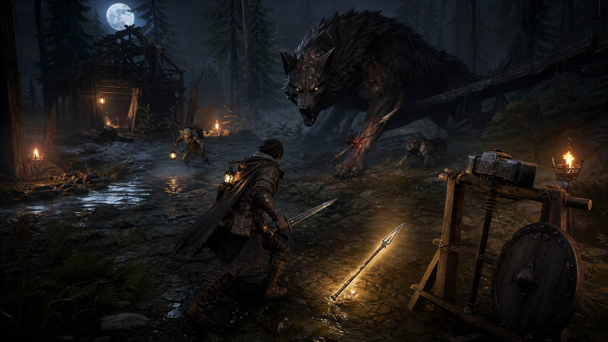

# Wolf Forest Visual Target

Reference image:



## Purpose

This is the current visual bar for the first `夜番の砦` vertical slice. The
Unity scene builder and later authored assets should move toward this read:

- lone night hunter in practical leather, cloak, boots, gloves, lantern, and
  weapon holders
- weapon pickup visible near the player, not hidden at the side of the scene
- weapon rack and alternate weapons visible in the first combat space
- dark forest with blue moonlight, warm torch/lantern light, low mist, wet
  ground, fallen tree, stream, and hunter shack silhouette
- large original night wolf readable at game-camera distance, with legs, muzzle,
  amber eyes, red scars, and a spear-target leg cue
- small enemy pressure in the midground without cluttering the screenshot

## Reject Criteria

- gray box floor, default sky, or mannequin-only character
- dark image where silhouettes, weapons, or pickups cannot be read
- weapon shapes that only read as cylinders
- wolf boss that reads as a shapeless dark blob
- UI text carrying the whole concept because the image itself is unclear
- copied silhouettes, armor, monsters, UI, logos, or weapon designs from any
  existing game

## Generation Prompt

```text
Create a polished in-game screenshot target for the original game "夜番の砦" /
"Nightwatch Fortress". The image must clearly communicate the hook: a lone night
watch hunter survives by picking up and swapping weapons found on the ground
while fighting a huge night wolf in a moonlit forest.

Scene/backdrop: dark but readable moonlit forest clearing called Wolf Forest,
wet ground, shallow stream, hunter shack silhouette, fallen tree, warm torch
pools, cold blue moonlight, thin ground mist, practical fantasy atmosphere.

Subject: one original lone hunter in leather armor, cloth cloak, boots, gloves,
belt pouches, shoulder lantern, practical weapon holders; no existing IP
resemblance. The hunter is mid-action near a glowing pickup spear on the ground,
with a sword in hand and a large hammer and shield visible on a nearby weapon
rack.

Enemy: an original giant black night wolf, readable legs, long muzzle, amber
eyes, red scars, a clear vulnerable front leg target where a spear can be
embedded. Add one small wolf and one goblin-like weapon carrier in the
midground, but keep the composition readable.

Composition: third-person game camera behind and slightly above the player,
16:9 wide screenshot composition, player in lower third, weapon pickup clearly
visible, Garm looming in the upper/middle distance, UI-free except subtle
game-feel framing; no text, no logo, no watermark.

Style: commercial early prototype quality, stylized low-to-mid poly 3D game art
with authored lighting and materials, not gray boxes, not a default engine
scene, not placeholder primitives, strong silhouettes, readable combat spacing.

Negative constraints: do not copy Dark Souls, Elden Ring, Monster Hunter,
Diablo, Hades, V Rising, or any known character/monster design; no text; no UI
labels; no logo; no watermark; no over-dark unreadable image; no generic
asset-store pileup.
```
